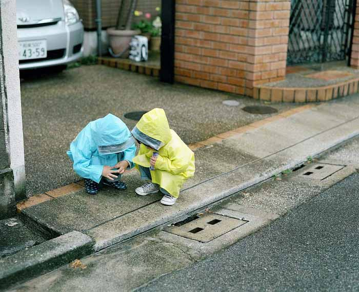
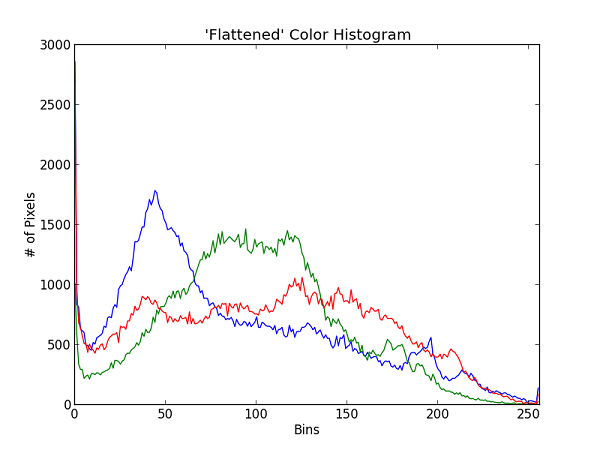
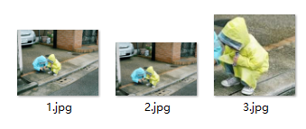

# Image hash algorithm implementation in pure Python
---

###Python3.x

###Requirement

[PIL](https://pypi.python.org/pypi/PIL)

---

###Original Image 

    
###Average hash   

1.  resize the image to 8 x 8 with ANTIALIAS and convert to grayscale  ('L')       

2.  calculate the average of 64 grayscales
3.  compare the 64 grayscales to the average if greater than avg get 1 else get 0
4.  convert binary to decimal integer using shift operator

**return: hash value**
> 4357514113602036515

###[color histogram hash](https://en.wikipedia.org/wiki/Color_histogram)
The formation of a color histogram is rather simple. From the definition above, we can simply count the number of pixels for each 256 scales in each of the 3 RGB channel, and plot them on 3 individual bar graphs.

In general, a color histogram is based on a certain color space, such as RGB or HSV. When we compute the pixels of different colors in an image, if the color space is large, then we can first divide the color space into certain numbers of small intervals. Each of the intervals is called a bin. This process is called color quantization. Then, by counting the number of pixels in each of the bins, we get the color histogram of the image.

Using PIL to get the image data and generate RGB color histogram.

Using four bins. Bin 0 corresponds to intensities 0-63, bin 1 is 64-127, bin 2 is 128-191, and bin 3 is 192-255.

R | G | B | Count
----|----|----|----
0|0|0|76
0|0|1|2
0|0|2|34
0|0|3|13
0|1|0|141
0|1|1|134
0|1|2|35
0|1|3|21

**return 64-dimensional vector to calculate cosine similarity**
>[18269, 70, 0, 0, 3639, 2833, 66, 0, 0, 0, 359, 16, 0, 0, 0, 0, 84....]

### Perceptive hash

1.  resize the image to 32 x 32 with ANTIALIAS and convert to grayscale  ('L')      

2.  use a discrete cosine transform (DCT) and generate the 32x32 coefficients matrix.(In fact,we only use the upper left corner,so I just generate the 8x8 coefficients matrix.)      

3.  calculate the average of the matrix.
4.  compare the pixels to the average if greater than avg get 1 else get 0
5.  convert binary to decimal integer using shift operator

The returned DCT coefficients is same as the result of Matlab 'dct2' function.

    [3957.937500000001, -6.45782564328, 23.551805262031117, 287.9702588579284, -43.60357823583293, 110.2479312475327, 53.15931722426795, 5.406303839931143]
    [-327.3585995570752, 340.9328561602328, 487.88585128367384, 334.6670101433679, -25.65124783757791, 99.13930862987212, 71.92070113492402, -59.812612503827786]
    [-350.05545576158727, 183.65973191996815, -93.1792453549336, 300.0783925042408, -139.46414055118524, -148.99404374084457, -24.21862416571144, -150.40174329828017]
    [419.31459259081566, 39.971825376992214, 35.118460724579144, 88.72554147729983, 57.99868007783289, -7.824272528869479, -198.8164227675179, -94.34402138216764]
    [222.01687562677304, 104.70521732373949, -28.943253196130463, -152.00281381518312, -44.74692917448203, 25.365925196549245, 20.968129431307037, -26.563506164925084]
    [-208.0520373074981, -49.43037862161907, 29.310824116620022, 32.009755685611026, 124.70463249710798, -24.948166138795766, -92.75103158294787, 13.10849521985365]
    [-105.39332350766952, -44.401129254094535, 39.64988864697462, -86.79477136259145, -16.435764130025756, -22.578982094348916, 68.27141328357092, 81.19329683038744]
    [-17.42272275896725, -113.80984679223711, 40.342601381802034, 41.396028432989674, -87.63669517505066, 68.82287427897536, 22.057683843368007, -32.07442266899904]

### Difference hash

##Compare 

* Average hash is fast but not very accurate,sometimes it generates a lot of false positives.

Average hash:

    2034634172563202339
    4357514113602036515
    8716924057964842500

After calculating the hamming distances between them,I find it is a false positive.The hamming distance between image1 and image2 is 12.Not very good.

* Color histogram is a good way to identify similar pictures.But if you don't zoom out the image,it will take you a lot of time.
It depends on the colors of overall picture,to some extent it is a excellent algorithm.
The cosine similarity between image1 and image2 is **0.9968383379981955**.
It means they are almost the same image.But it cannot identify image2 and image3,the cosine similarity between them is **0.8406195273168274**.

* Perceptive hash algorithm definitely has the best accuracy.But it takes more time.  

Perceptive hash:
  
    10376294653993037321
    36046402241572393
    319773203310626353
    
The hamming distance between image1 and image2 is 7, the performance is really good.